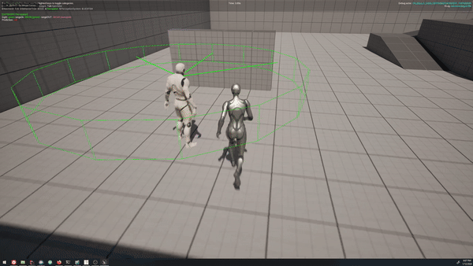

# Prediction Sense Plus

This is a simple improvement for the `UAISense_Prediction` I always add to any project I use it in. All it does it 
throw a line trace between predicted actor and its predicted location, so that the sense doesn't predict it behind 
or inside a wall.

```c++
FVector UAISense_PredictionPlus::GetPredictionLocation(const FAIPredictionEvent& Event) const
{
	const FVector TargetLocation = Event.PredictedActor->GetActorLocation();
	const FVector TargetVelocity = Event.PredictedActor->GetVelocity();
	const FVector Displacement = TargetVelocity * Event.TimeToPredict;
	const FVector DefaultPredictLocation = TargetLocation + Displacement;

	const UWorld* World = GetWorld();

	FCollisionQueryParams QueryParams;
	QueryParams.AddIgnoredActor(Event.PredictedActor);

	FHitResult Hit;
	World->LineTraceSingleByChannel(Hit, TargetLocation, DefaultPredictLocation, CollisionChannel, QueryParams);

	if (!Hit.bBlockingHit)
	{
		return DefaultPredictLocation;
	}

	// Don't predict if anything is on the way
	const FVector ScaledNormal = Hit.ImpactNormal * BounceOffWall;
	const FVector PredictLocation = Hit.Location + ScaledNormal;
	return PredictLocation;
}
```

## Original Prediction Sense



## Prediction Sense Plus


